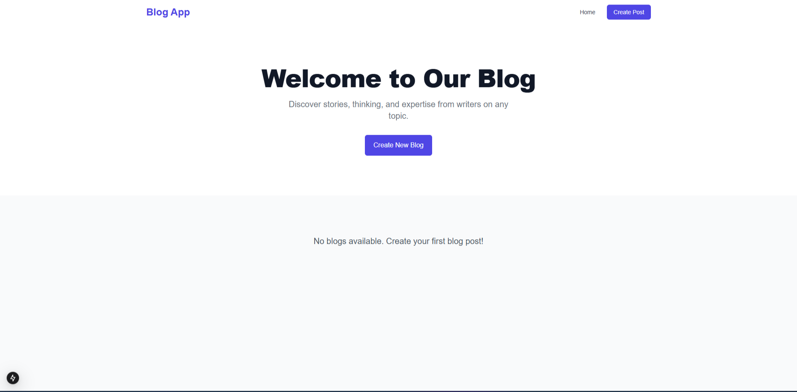

# Next.js Blog Application

A modern, feature-rich blogging platform built with Next.js, TypeScript, and React. This application provides a seamless writing and reading experience with a clean, responsive user interface.

## Features

- 📝 Modern blog post editor
- 🎨 Clean and responsive design
- 🚀 Built with Next.js for optimal performance
- 💻 TypeScript for enhanced development experience
- 📱 Mobile-friendly interface
- 🔍 SEO optimized

## Tech Stack

- Next.js
- TypeScript
- React
- Tailwind CSS

## Getting Started

### Prerequisites

- Node.js (version 18 or higher)
- npm or yarn package manager

### Installation

1. Clone the repository:
```bash
git clone https://github.com/Yassen717/Blog-app.git
```

2. Install dependencies:
```bash
cd Blog-app
npm install
# or
yarn install
```

3. Run the development server:
```bash
npm run dev
# or
yarn dev
```

4. Open [http://localhost:3000](http://localhost:3000) with your browser to see the result.

## Project Structure

```
Blog-app/
├── app/                # Next.js app directory
├── components/         # Reusable React components
├── public/            # Static files
├── styles/           # Global styles
└── types/            # TypeScript type definitions
```

## Contributing

Contributions are welcome! Please feel free to submit a Pull Request.
